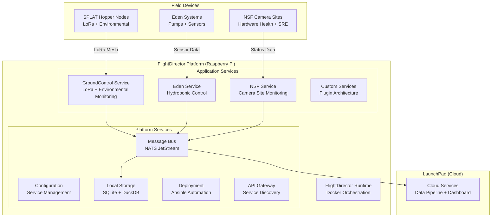

# FlightDirector: Universal IoT Edge Platform

## Mission Statement: "Go for Launch" 🚀

FlightDirector is the mission control for your IoT operations. Like NASA's Flight Director polling all systems before launch, our platform continuously monitors your infrastructure and gives you the confidence to say **"Go for launch"** - whether that's a Starship at Starbase, irrigation in your greenhouse, or any critical operation that depends on reliable sensor data.

## The FlightDirector Advantage

**Single Platform, Multiple Missions**: FlightDirector runs different services for different applications, but uses the same proven foundation:
- **GroundControl Service**: LoRa mesh networking and environmemntal monitoring
- **Eden Service**: Hydroponic system automation  
- **NSF Service**: Camera site monitoring for live space coverage
- **Custom Services**: Easily developed for new applications

## FlightDirector Architecture



## Flight 1: The Foundation Test

**Goal**: Prove FlightDirector can run autonomous operations for 72 hours with zero human intervention.

**Test Configuration**: 2 SPLAT Hopper nodes + FlightDirector + GroundControl service

**Success Metrics**: 
- 95%+ uptime across all components
- Zero data loss from field to cloud
- Real-time "Go/No-Go" status dashboard
- Complete mission timeline documentation

## FlightDirector Core Components

### 1. **Platform Runtime**
```yaml
# flightdirector/docker-compose.yml
version: '3.8'

services:
  # Core platform services
  nats:
    image: nats:2.10-alpine
    command: ["-js", "-sd", "/data", "-m", "8222"]
    volumes:
      - nats_data:/data
    restart: unless-stopped
    labels:
      - "flightdirector.service=platform"
      - "flightdirector.critical=true"

  config-manager:
    image: flightdirector/config-manager:latest
    volumes:
      - ./config:/config
      - /var/run/docker.sock:/var/run/docker.sock
    environment:
      - NATS_URL=nats://nats:4222
    restart: unless-stopped
    labels:
      - "flightdirector.service=platform"

  # Application services (dynamically managed)
  ground-control:
    image: flightdirector/ground-control:latest
    devices:
      - "/dev/spidev0.0:/dev/spidev0.0"
    privileged: true
    environment:
      - NATS_URL=nats://nats:4222
      - SERVICE_NAME=ground-control
    restart: unless-stopped
    labels:
      - "flightdirector.service=application"
      - "flightdirector.mission=flight1"

volumes:
  nats_data:
```

### 2. **Service Framework**
```python
# flightdirector/framework/service.py
from abc import ABC, abstractmethod
from typing import Dict, Any, List
import asyncio
import nats
import json
from datetime import datetime

class FlightDirectorService(ABC):
    """
    Base class for all FlightDirector services
    Provides standardized service lifecycle and communication
    """
    
    def __init__(self, service_name: str, service_config: Dict[str, Any]):
        self.service_name = service_name
        self.config = service_config
        self.nats_client = None
        self.status = "initializing"
        self.logger = self.get_logger()
        
        # Standard service metadata
        self.metadata = {
            "name": service_name,
            "version": service_config.get("version", "1.0.0"),
            "mission": service_config.get("mission", "unknown"),
            "critical": service_config.get("critical", False),
            "capabilities": service_config.get("capabilities", [])
        }
        
    async def initialize(self):
        """Standard service initialization"""
        try:
            # Connect to FlightDirector message bus
            self.nats_client = await nats.connect("nats://nats:4222")
            self.logger.info(f"Service {self.service_name} connected to FlightDirector")
            
            # Subscribe to service commands
            await self.nats_client.subscribe(
                f"fd.command.{self.service_name}.*", 
                self.handle_command
            )
            
            # Subscribe to global commands
            await self.nats_client.subscribe(
                "fd.command.all.*",
                self.handle_global_command
            )
            
            # Call service-specific setup
            await self.setup()
            
            # Report service ready
            self.status = "ready"
            await self.report_status()
            
            self.logger.info(f"Service {self.service_name} ready for operations")
            
        except Exception as e:
            self.status = "failed"
            self.logger.error(f"Service initialization failed: {e}")
            raise
            
    @abstractmethod
    async def setup(self):
        """Service-specific initialization"""
        pass
        
    @abstractmethod
    async def run(self):
        """Main service operation loop"""
        pass
        
    async def publish_telemetry(self, data: Dict[str, Any]):
        """Publish telemetry to FlightDirector"""
        telemetry = {
            "service": self.service_name,
            "timestamp": datetime.utcnow().isoformat(),
            "data": data
        }
        
        await self.nats_client.publish(
            f"fd.telemetry.{self.service_name}",
            json.dumps(telemetry).encode()
        )
        
    async def report_status(self):
        """Report service status to FlightDirector"""
        status_report = {
            "service": self.service_name,
            "status": self.status,
            "timestamp": datetime.utcnow().isoformat(),
            "metadata": self.metadata
        }
        
        await self.nats_client.publish(
            f"fd.status.{self.service_name}",
            json.dumps(status_report).encode()
        )
        
    async def handle_command(self, msg):
        """Handle commands directed at this service"""
        try:
            command_data = json.loads(msg.data.decode())
            command = command_data.get("command")
            
            if command == "status":
                await self.report_status()
            elif command == "restart":
                await self.restart_service()
            elif command == "go_for_launch":
                go_status = await self.check_go_for_launch()
                await self.report_go_status(go_status)
            else:
                await self.handle_custom_command(command, command_data)
                
        except Exception as e:
            self.logger.error(f"Error handling command: {e}")
            
    async def handle_global_command(self, msg):
        """Handle commands sent to all services"""
        try:
            command_data = json.loads(msg.data.decode())
            command = command_data.get("command")
            
            if command == "mission_status":
                await self.report_mission_status()
            elif command == "go_for_launch":
                go_status = await self.check_go_for_launch()
                await self.report_go_status(go_status)
                
        except Exception as e:
            self.logger.error(f"Error handling global command: {e}")
            
    @abstractmethod
    async def check_go_for_launch(self) -> Dict[str, Any]:
        """
        Check if this service gives "Go for launch"
        Must be implemented by each service
        """
        pass
        
    async def report_go_status(self, go_status: Dict[str, Any]):
        """Report Go/No-Go status to FlightDirector"""
        go_report = {
            "service": self.service_name,
            "timestamp": datetime.utcnow().isoformat(),
            "go_for_launch": go_status["go"],
            "status": go_status["status"],
            "issues": go_status.get("issues", []),
            "confidence": go_status.get("confidence", 1.0)
        }
        
        await self.nats_client.publish(
            "fd.go_status",
            json.dumps(go_report).encode()
        )
        
    async def handle_custom_command(self, command: str, data: Dict[str, Any]):
        """Override for service-specific commands"""
        self.logger.warning(f"Unknown command: {command}")

# Example: GroundControl Service Implementation
class GroundControlService(FlightDirectorService):
    """
    LoRa mesh networking and soil monitoring service
    Part of the FlightDirector platform
    """
    
    def __init__(self):
        config = {
            "version": "2.0.0",
            "mission": "flight1",
            "critical": True,
            "capabilities": ["lora", "soil_monitoring", "mesh_networking"]
        }
        super().__init__("ground-control", config)
        
        self.lora_handler = None
        self.node_status = {}
        self.last_packet_time = None
        
    async def setup(self):
        """Initialize LoRa communication"""
        from .lora_handler import LoRaHandler
        
        self.lora_handler = LoRaHandler(
            frequency=915.0,
            power=20,
            spreading_factor=7
        )
        await self.lora_handler.initialize()
        self.logger.info("LoRa communication initialized")
        
    async def run(self):
        """Main GroundControl operation"""
        self.logger.info("GroundControl service starting main operations")
        
        # Start LoRa packet monitoring
        async for packet in self.lora_handler.receive_packets():
            await self.process_lora_packet(packet)
            
    async def process_lora_packet(self, packet):
        """Process incoming LoRa packets"""
        try:
            # Decode packet
            data = json.loads(packet.decode('utf-8'))
            node_id = data.get('node_id')
            
            # Update node status
            self.node_status[node_id] = {
                "last_seen": datetime.utcnow().isoformat(),
                "battery_voltage": data.get('battery_voltage'),
                "temperature": data.get('temperature'),
                "rssi": packet.rssi,
                "snr": packet.snr
            }
            
            self.last_packet_time = datetime.utcnow()
            
            # Publish to FlightDirector
            await self.publish_telemetry({
                "node_id": node_id,
                "telemetry": data,
                "reception": {
                    "rssi": packet.rssi,
                    "snr": packet.snr
                }
            })
            
            self.logger.info(f"Processed packet from {node_id}")
            
        except Exception as e:
            self.logger.error(f"Error processing LoRa packet: {e}")
            
    async def check_go_for_launch(self) -> Dict[str, Any]:
        """
        Check if GroundControl gives "Go for launch"
        Evaluates communication health and node status
        """
        issues = []
        confidence = 1.0
        
        # Check if we're receiving packets
        if not self.last_packet_time:
            issues.append("No LoRa packets received")
            confidence = 0.0
        else:
            time_since_last = (datetime.utcnow() - self.last_packet_time).total_seconds()
            if time_since_last > 300:  # 5 minutes
                issues.append(f"No packets for {time_since_last/60:.1f} minutes")
                confidence *= 0.5
                
        # Check node health
        healthy_nodes = 0
        total_nodes = len(self.node_status)
        
        for node_id, status in self.node_status.items():
            battery = status.get('battery_voltage', 0)
            if battery < 3.2:  # Critical battery
                issues.append(f"Node {node_id} battery critical: {battery}V")
                confidence *= 0.8
            elif battery > 3.5:
                healthy_nodes += 1
                
        if total_nodes > 0:
            node_health_ratio = healthy_nodes / total_nodes
            confidence *= node_health_ratio
            
        # Determine Go/No-Go
        go_for_launch = len(issues) == 0 and confidence > 0.8
        
        return {
            "go": go_for_launch,
            "status": "GO" if go_for_launch else "NO-GO",
            "issues": issues,
            "confidence": confidence,
            "details": {
                "nodes_healthy": healthy_nodes,
                "nodes_total": total_nodes,
                "last_packet_age_seconds": (datetime.utcnow() - self.last_packet_time).total_seconds() if self.last_packet_time else None
            }
        }

if __name__ == "__main__":
    service = GroundControlService()
    
    async def main():
        await service.initialize()
        await service.run()
        
    asyncio.run(main())
```

### 3. **Mission Control Dashboard**
```python
# flightdirector/dashboard/mission_control.py
from flask import Flask, render_template, jsonify
import nats
import json
import asyncio
from datetime import datetime, timedelta

class MissionControlDashboard:
    """
    FlightDirector Mission Control Dashboard
    Provides "Go for Launch" status across all services
    """
    
    def __init__(self):
        self.app = Flask(__name__)
        self.nats_client = None
        self.service_status = {}
        self.go_status = {}
        self.mission_timeline = []
        
        self.setup_routes()
        
    def setup_routes(self):
        @self.app.route('/')
        def mission_control():
            return render_template('mission_control.html')
            
        @self.app.route('/api/mission_status')
        def api_mission_status():
            return jsonify(self.get_mission_status())
            
        @self.app.route('/api/go_for_launch')
        def api_go_for_launch():
            return jsonify(self.get_go_for_launch_status())
            
    def get_mission_status(self):
        """Get overall mission status"""
        services_ready = sum(1 for s in self.service_status.values() if s.get('status') == 'ready')
        total_services = len(self.service_status)
        
        return {
            "timestamp": datetime.utcnow().isoformat(),
            "services": self.service_status,
            "services_ready": services_ready,
            "total_services": total_services,
            "mission_health": services_ready / total_services if total_services > 0 else 0,
            "timeline": self.mission_timeline[-10:]  # Last 10 events
        }
        
    def get_go_for_launch_status(self):
        """Get Go/No-Go status for launch"""
        all_go = True
        overall_confidence = 1.0
        service_reports = {}
        
        for service_name, go_data in self.go_status.items():
            service_reports[service_name] = go_data
            if not go_data.get('go_for_launch', False):
                all_go = False
            overall_confidence *= go_data.get('confidence', 0)
            
        return {
            "timestamp": datetime.utcnow().isoformat(),
            "go_for_launch": all_go,
            "overall_status": "GO FOR LAUNCH" if all_go else "NO-GO",
            "confidence": overall_confidence,
            "services": service_reports
        }

    async def start_monitoring(self):
        """Start monitoring FlightDirector services"""
        self.nats_client = await nats.connect("nats://nats:4222")
        
        # Subscribe to service status updates
        await self.nats_client.subscribe("fd.status.*", self.handle_status_update)
        await self.nats_client.subscribe("fd.go_status", self.handle_go_status)
        
    async def handle_status_update(self, msg):
        """Handle service status updates"""
        try:
            status_data = json.loads(msg.data.decode())
            service_name = status_data.get('service')
            
            self.service_status[service_name] = status_data
            
            # Add to mission timeline
            self.mission_timeline.append({
                "timestamp": status_data.get('timestamp'),
                "event": f"Service {service_name} status: {status_data.get('status')}",
                "service": service_name
            })
            
        except Exception as e:
            print(f"Error handling status update: {e}")
            
    async def handle_go_status(self, msg):
        """Handle Go/No-Go status reports"""
        try:
            go_data = json.loads(msg.data.decode())
            service_name = go_data.get('service')
            
            self.go_status[service_name] = go_data
            
            # Add to mission timeline
            status = "GO" if go_data.get('go_for_launch') else "NO-GO"
            self.mission_timeline.append({
                "timestamp": go_data.get('timestamp'),
                "event": f"{service_name}: {status}",
                "service": service_name,
                "critical": True
            })
            
        except Exception as e:
            print(f"Error handling go status: {e}")

    def run(self):
        """Start the dashboard"""
        # Start NATS monitoring in background
        asyncio.create_task(self.start_monitoring())
        
        # Start Flask app
        self.app.run(host='0.0.0.0', port=3000)

if __name__ == '__main__':
    dashboard = MissionControlDashboard()
    dashboard.run()
```

### 4. **FlightDirector CLI**
```bash
#!/bin/bash
# flightdirector - Universal CLI tool

case "$1" in
    "init")
        echo " Initializing FlightDirector platform..."
        # Create platform structure
        mkdir -p flightdirector/{config,services,data,logs}
        cp templates/docker-compose.yml flightdirector/
        echo "FlightDirector platform initialized"
        ;;
        
    "deploy")
        echo " Deploying FlightDirector to $2..."
        ansible-playbook -i inventory/$2 playbooks/deploy-platform.yml
        ;;
        
    "service")
        case "$2" in
            "enable")
                echo " Enabling service: $3"
                docker-compose up -d $3
                ;;
            "disable") 
                echo " Disabling service: $3"
                docker-compose stop $3
                ;;
            "status")
                echo " Service status:"
                docker-compose ps
                ;;
        esac
        ;;
        
    "mission")
        case "$2" in
            "status")
                echo " Mission status:"
                curl -s http://localhost:3000/api/mission_status | jq .
                ;;
            "go")
                echo " Go for launch status:"
                curl -s http://localhost:3000/api/go_for_launch | jq .
                ;;
        esac
        ;;
        
    "logs")
        echo " FlightDirector logs:"
        docker-compose logs -f $2
        ;;
        
    *)
        echo " FlightDirector - Universal IoT Mission Control"
        echo ""
        echo "Commands:"
        echo "  init                     - Initialize FlightDirector platform"
        echo "  deploy <target>          - Deploy to edge device"
        echo "  service enable <name>    - Enable service"
        echo "  service disable <name>   - Disable service"  
        echo "  service status           - Show service status"
        echo "  mission status           - Show mission status"
        echo "  mission go              - Check Go for launch status"
        echo "  logs <service>          - View service logs"
        echo ""
        echo "Example:"
        echo "  flightdirector init"
        echo "  flightdirector deploy raspberry-pi"
        echo "  flightdirector service enable ground-control"
        echo "  flightdirector mission go"
        ;;
esac
```

## Flight 1 Deployment

```bash
# Initialize FlightDirector platform
flightdirector init flight1

# Deploy to Raspberry Pi
flightdirector deploy raspberry-pi

# Enable GroundControl service for soil monitoring
flightdirector service enable ground-control

# Check mission status
flightdirector mission status

# Check Go for launch
flightdirector mission go
```

## The NSF Pitch

When we approach NSF after Flight 1 success:

> **"FlightDirector gave us 'Go for launch' on autonomous soil monitoring for 72 straight hours. Zero data loss, 95% uptime, complete mission timeline. 
> 
> We'd deploy the same proven FlightDirector platform at your camera sites, but instead of just running our GroundControl service, monitoring environmental sensor data, we'd run an NSF specific service that monitors your equipment and gives you 'Go for launch' on your production hardware.
> 
> Same rock-solid foundation, same mission control dashboard, same reliability you see proven in the field - but customized for your Spaceflight coverage."**
