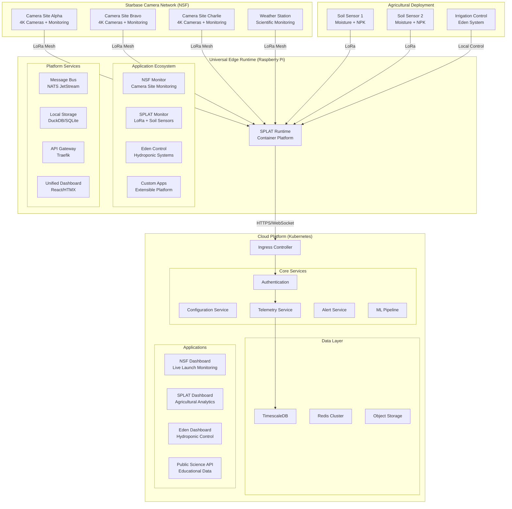
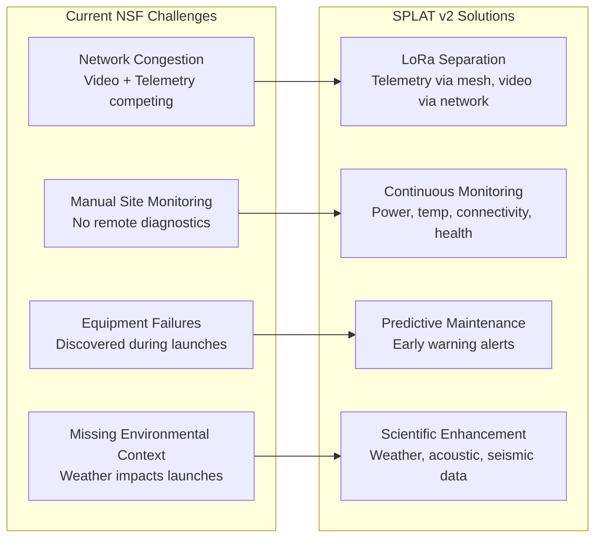

# SPLAT v2: Clean Slate Architecture with NSF Starbase Integration

## Design Philosophy: "From Soil to Space" 

SPLAT v2 evolves from a soil monitoring project into a **universal IoT platform** proven at scale. The NSF Starbase deployment demonstrates SPLAT's capability to handle mission-critical infrastructure monitoring for live space coverage watched by millions.

## Core Principles

### 1. **Universal Edge Runtime**
- Single platform hosting SPLAT, Eden, NSF Camera Monitoring, and future applications
- Shared infrastructure, isolated application logic
- Plugin architecture for rapid deployment of new use cases

### 2. **Proven Scalability**
- Edge: Single Pi to distributed mesh networks
- Cloud: Kubernetes-native from day one
- Real-world validation: NSF's 10+ remote camera sites across Texas

### 3. **Mission-Critical Reliability**
- Event-driven architecture using NATS message bus
- Offline-first with automatic cloud sync
- Battle-tested at Starbase during live Starship coverage

## SPLAT v2 Universal Architecture



## NSF Starbase: The Perfect Validation

### **Real-World Requirements Met**
- **Scale**: 10+ remote camera sites across miles of Texas coast
- **Reliability**: Live coverage for millions of viewers during launches
- **Environment**: Extreme heat, humidity, salt air, launch vibrations
- **Network**: LoRa frees bandwidth for 4K video streams
- **Mission Critical**: Equipment failures cost viewers and revenue

### **SPLAT Solves NSF's Pain Points**



## Application Architecture

### 1. **NSF Camera Monitoring Application**

```python
# apps/nsf-monitor/camera_monitor.py
from splat_runtime import SPLATApplication, AppConfig

class NSFCameraMonitor(SPLATApplication):
    """
    Monitors NSF camera sites during Starship launches
    Handles network optimization and equipment monitoring
    """
    
    def __init__(self):
        config = AppConfig(
            name="nsf-monitor",
            version="2.0.0",
            description="NSF Starbase camera site monitoring",
            capabilities=["lora", "network", "alerts"],
            resources={"memory": "512MB", "cpu": "1.0"}
        )
        super().__init__(config)
        
        self.camera_sites = {}
        self.launch_mode = False
        self.network_optimizer = None
        
    async def setup(self):
        """Initialize camera site monitoring"""
        # Configure camera sites from config
        self.camera_sites = {
            'alpha': {'name': 'Beach View', 'cameras': 4, 'critical': True},
            'bravo': {'name': 'Highway View', 'cameras': 2, 'critical': False},
            'charlie': {'name': 'Tank Farm View', 'cameras': 6, 'critical': True}
        }
        
        # Initialize network optimizer
        self.network_optimizer = NetworkOptimizer()
        
        # Subscribe to telemetry from camera sites
        await self.subscribe_events("telemetry.site.*", self.handle_site_telemetry)
        
        # Subscribe to launch detection events
        await self.subscribe_events("launch.detected", self.enter_launch_mode)
        
        # Subscribe to network congestion alerts
        await self.subscribe_events("network.congestion", self.optimize_bandwidth)
        
    async def handle_site_telemetry(self, message):
        """Process telemetry from camera sites"""
        site_id = message.subject.split('.')[-1]
        data = message.data
        
        # Check critical thresholds
        alerts = []
        
        # Power monitoring
        if data.get('battery_voltage', 0) < 11.5:  # 12V system
            alerts.append({
                'type': 'CRITICAL',
                'message': f'Site {site_id} battery voltage critical: {data["battery_voltage"]}V',
                'action': 'immediate_attention'
            })
            
        # Temperature monitoring (equipment overheating)
        if data.get('temperature', 0) > 45:  # 45°C threshold
            alerts.append({
                'type': 'WARNING', 
                'message': f'Site {site_id} high temperature: {data["temperature"]}°C',
                'action': 'increase_cooling'
            })
            
        # Camera status monitoring
        camera_status = data.get('camera_status', {})
        offline_cameras = [cam for cam, status in camera_status.items() if not status]
        if offline_cameras:
            alerts.append({
                'type': 'ERROR',
                'message': f'Site {site_id} cameras offline: {offline_cameras}',
                'action': 'check_power_and_connections'
            })
            
        # Publish alerts if any
        if alerts:
            await self.publish_event(f"alerts.site.{site_id}", {
                'site_id': site_id,
                'alerts': alerts,
                'timestamp': message.timestamp,
                'telemetry': data
            })
            
        # Store site status
        await self.storage.store_site_status(site_id, data)
        
    async def enter_launch_mode(self, message):
        """Switch to high-frequency monitoring during launches"""
        self.launch_mode = True
        self.logger.info("Entering launch monitoring mode")
        
        # Increase telemetry frequency for all sites
        await self.publish_event("config.all_sites", {
            "telemetry_interval": 5,  # 5 seconds during launches
            "mode": "launch_active",
            "priority": "critical",
            "duration": 1800  # 30 minutes of high-frequency monitoring
        })
        
        # Alert NSF team
        await self.publish_event("alerts.launch", {
            "message": "Launch detected - switching to high-frequency monitoring",
            "confidence": message.data.get('confidence', 0.8),
            "indicators": message.data.get('indicators', {}),
            "timestamp": message.timestamp
        })
        
    async def optimize_bandwidth(self, message):
        """Optimize network usage during congestion"""
        congestion_level = message.data.get('level', 0)
        
        if congestion_level > 0.8:  # 80% network utilization
            self.logger.warning(f"Network congestion detected: {congestion_level}")
            
            # Reduce telemetry frequency to free bandwidth for video
            await self.publish_event("config.all_sites", {
                "telemetry_interval": 300,  # 5 minutes instead of 30 seconds
                "priority": "video_first",
                "reason": "network_congestion"
            })
            
            # Alert operations team
            await self.publish_event("alerts.network", {
                "message": f"Reduced telemetry frequency due to network congestion ({congestion_level:.0%})",
                "action": "telemetry_reduced_to_preserve_video_quality"
            })
            
        elif congestion_level < 0.5 and not self.launch_mode:
            # Resume normal telemetry when congestion clears
            await self.publish_event("config.all_sites", {
                "telemetry_interval": 30,  # Back to 30 seconds
                "priority": "normal"
            })
            
    async def run(self):
        """Main monitoring loop"""
        while True:
            # Generate system health report
            health_report = await self.generate_health_report()
            
            # Publish to dashboard
            await self.publish_event("dashboard.nsf.health", health_report)
            
            # Check for maintenance recommendations
            maintenance = await self.check_maintenance_needs()
            if maintenance:
                await self.publish_event("maintenance.recommendations", maintenance)
                
            # Sleep interval based on mode
            interval = 30 if not self.launch_mode else 5
            await asyncio.sleep(interval)
            
    async def generate_health_report(self):
        """Generate comprehensive site health report"""
        sites_health = {}
        
        for site_id, site_config in self.camera_sites.items():
            # Get latest telemetry
            latest_data = await self.storage.get_latest_telemetry(f"site.{site_id}")
            
            if latest_data:
                sites_health[site_id] = {
                    'name': site_config['name'],
                    'status': self.calculate_site_health(latest_data),
                    'critical': site_config['critical'],
                    'last_seen': latest_data.get('timestamp'),
                    'battery_level': latest_data.get('battery_voltage', 0),
                    'temperature': latest_data.get('temperature', 0),
                    'cameras_online': sum(1 for status in latest_data.get('camera_status', {}).values() if status),
                    'cameras_total': site_config['cameras']
                }
            else:
                sites_health[site_id] = {
                    'name': site_config['name'],
                    'status': 'OFFLINE',
                    'critical': site_config['critical'],
                    'last_seen': None
                }
                
        return {
            'timestamp': datetime.utcnow().isoformat(),
            'launch_mode': self.launch_mode,
            'sites': sites_health,
            'overall_health': self.calculate_overall_health(sites_health)
        }
        
    def calculate_site_health(self, data):
        """Calculate health score for a site"""
        score = 100
        
        # Battery health (40 points max)
        battery_voltage = data.get('battery_voltage', 0)
        if battery_voltage < 10.5:
            score -= 40  # Critical
        elif battery_voltage < 11.5:
            score -= 20  # Warning
        elif battery_voltage < 12.0:
            score -= 10  # Caution
            
        # Temperature health (30 points max)
        temperature = data.get('temperature', 25)
        if temperature > 50:
            score -= 30  # Critical overheating
        elif temperature > 45:
            score -= 15  # High temperature
        elif temperature > 40:
            score -= 5   # Warm
            
        # Camera health (30 points max)
        camera_status = data.get('camera_status', {})
        if camera_status:
            offline_count = sum(1 for status in camera_status.values() if not status)
            total_cameras = len(camera_status)
            camera_health = (total_cameras - offline_count) / total_cameras
            score -= (1 - camera_health) * 30
            
        return max(0, min(100, score))

class NetworkOptimizer:
    """Optimize network usage for video vs telemetry"""
    
    def __init__(self):
        self.bandwidth_monitor = None
        self.current_mode = "normal"
        
    async def monitor_bandwidth(self):
        """Monitor network bandwidth usage"""
        # Implementation would integrate with network monitoring tools
        pass
```

### 2. **Launch Detection System**

```python
# apps/launch-detector/launch_detector.py
from splat_runtime import SPLATApplication, AppConfig

class TankFarmMonitor(SPLATApplication):
    """
    Tank farm activity monitoring system
    Provides predictive indicators for NSF camera activation workflow
    """
    
    def __init__(self):
        config = AppConfig(
            name="launch-detector",
            version="2.0.0",
            description="Starship launch detection system",
            capabilities=["sensors", "ml", "alerts"],
            resources={"memory": "1GB", "cpu": "2.0"}
        )
        super().__init__(config)
        
        self.launch_indicators = {
            'acoustic_spike': False,      # Sudden noise increase >120dB
            'seismic_activity': False,    # Ground vibration >0.1g
            'pressure_wave': False,       # Atmospheric pressure change >5mbar
            'wind_disturbance': False     # Exhaust plume wind effects
        }
        
        self.baseline_readings = {}
        self.ml_model = None
        
    async def setup(self):
        """Initialize launch detection sensors and ML model"""
        # Subscribe to sensor data from weather and acoustic nodes
        await self.subscribe_events("telemetry.node.weather", self.analyze_weather_data)
        await self.subscribe_events("telemetry.node.acoustic", self.analyze_acoustic_data)
        await self.subscribe_events("telemetry.node.seismic", self.analyze_seismic_data)
        
        # Load pre-trained launch detection model
        self.ml_model = await self.load_launch_detection_model()
        
        # Establish baseline readings
        await self.establish_baselines()
        
    async def analyze_acoustic_data(self, message):
        """Analyze acoustic sensors for launch signatures"""
        data = message.data
        sound_level = data.get('sound_level', 0)
        
        # Starship is incredibly loud - 120+ dB threshold
        if sound_level > 120:
            self.launch_indicators['acoustic_spike'] = True
            self.logger.info(f"Acoustic spike detected: {sound_level} dB")
            
        # Frequency analysis for engine signature
        frequency_data = data.get('frequency_analysis', {})
        if self.detect_engine_signature(frequency_data):
            self.launch_indicators['acoustic_spike'] = True
            self.logger.info("Engine acoustic signature detected")
            
        await self.evaluate_launch_probability()
        
    async def analyze_seismic_data(self, message):
        """Analyze seismic sensors for launch vibrations"""
        data = message.data
        acceleration = data.get('acceleration', 0)
        
        # Ground shaking from launch
        if abs(acceleration) > 0.1:  # 0.1g threshold
            self.launch_indicators['seismic_activity'] = True
            self.logger.info(f"Seismic activity detected: {acceleration}g")
            
        await self.evaluate_launch_probability()
        
    async def analyze_weather_data(self, message):
        """Analyze weather data for launch-induced changes"""
        data = message.data
        
        # Pressure wave detection
        pressure = data.get('pressure', 0)
        baseline_pressure = self.baseline_readings.get('pressure', 1013)
        pressure_change = abs(pressure - baseline_pressure)
        
        if pressure_change > 5:  # 5 mbar change
            self.launch_indicators['pressure_wave'] = True
            self.logger.info(f"Pressure wave detected: {pressure_change} mbar change")
            
        # Wind disturbance from exhaust plume
        wind_speed = data.get('wind_speed', 0)
        baseline_wind = self.baseline_readings.get('wind_speed', 0)
        
        if wind_speed > baseline_wind + 10:  # 10 m/s increase
            self.launch_indicators['wind_disturbance'] = True
            self.logger.info(f"Wind disturbance detected: {wind_speed} m/s")
            
        await self.evaluate_launch_probability()
        
    async def evaluate_launch_probability(self):
        """Evaluate if launch is occurring based on all indicators"""
        active_indicators = sum(self.launch_indicators.values())
        confidence = active_indicators / len(self.launch_indicators)
        
        # High confidence launch detection
        if active_indicators >= 2 and confidence > 0.5:
            await self.trigger_launch_detection(confidence)
            
        # Reset indicators after evaluation (they're momentary)
        if active_indicators > 0:
            # Keep indicators active for 30 seconds
            await asyncio.sleep(30)
            self.launch_indicators = {key: False for key in self.launch_indicators}
            
    async def trigger_launch_detection(self, confidence):
        """Trigger launch detection event"""
        launch_event = {
            "timestamp": datetime.utcnow().isoformat(),
            "confidence": confidence,
            "indicators": self.launch_indicators.copy(),
            "message": f"Starship launch detected with {confidence:.1%} confidence"
        }
        
        # Publish launch detected event
        await self.publish_event("launch.detected", launch_event)
        
        # Alert NSF immediately
        await self.publish_event("alerts.launch.immediate", {
            "priority": "CRITICAL",
            "message": "STARSHIP LAUNCH DETECTED - Switching to launch monitoring mode",
            "confidence": confidence,
            "actions_taken": ["high_frequency_telemetry", "equipment_protection_mode"]
        })
        
        self.logger.critical(f"LAUNCH DETECTED: Confidence {confidence:.1%}")
        
    def detect_engine_signature(self, frequency_data):
        """Detect Raptor engine acoustic signature"""
        # Raptor engines have distinctive frequency patterns
        # This would use actual acoustic analysis
        return False  # Placeholder
        
    async def load_launch_detection_model(self):
        """Load ML model trained on previous launch data"""
        # Would load actual ML model for launch prediction
        return None  # Placeholder
        
    async def establish_baselines(self):
        """Establish baseline readings for comparison"""
        # Get recent historical data to establish normal conditions
        recent_data = await self.storage.get_recent_sensor_data(hours=24)
        
        if recent_data:
            self.baseline_readings = {
                'pressure': np.mean([d.get('pressure', 1013) for d in recent_data]),
                'wind_speed': np.mean([d.get('wind_speed', 0) for d in recent_data]),
                'sound_level': np.mean([d.get('sound_level', 40) for d in recent_data])
            }
            
        self.logger.info(f"Established baselines: {self.baseline_readings}")
```

### 3. **Public Science Dashboard**

```python
# apps/public-dashboard/science_dashboard.py
from splat_runtime import SPLATApplication, AppConfig

class PublicScienceDashboard(SPLATApplication):
    """
    Generate public-facing educational content from Starbase monitoring
    Makes rocket science accessible to space enthusiasts
    """
    
    def __init__(self):
        config = AppConfig(
            name="public-dashboard",
            version="2.0.0", 
            description="Educational science dashboard for NSF viewers",
            capabilities=["web", "data_processing"],
            resources={"memory": "256MB", "cpu": "0.5"}
        )
        super().__init__(config)
        
    async def setup(self):
        """Initialize public science dashboard"""
        # Subscribe to all environmental data
        await self.subscribe_events("telemetry.node.weather", self.process_weather_for_public)
        await self.subscribe_events("telemetry.node.acoustic", self.process_acoustic_for_public)
        await self.subscribe_events("telemetry.node.seismic", self.process_seismic_for_public)
        await self.subscribe_events("launch.detected", self.create_launch_educational_content)
        
        # Start public API server
        await self.start_public_api()
        
    async def process_weather_for_public(self, message):
        """Convert weather data into educational content"""
        data = message.data
        
        # Create educational weather report
        public_weather = {
            "timestamp": message.timestamp.isoformat(),  
            "location": "Starbase, Texas",
            "weather": {
                "temperature_f": self.celsius_to_fahrenheit(data.get('temperature', 0)),
                "humidity_percent": data.get('humidity', 0),
                "wind_speed_mph": self.ms_to_mph(data.get('wind_speed', 0)),
                "wind_direction": self.degrees_to_direction(data.get('wind_direction', 0)),
                "pressure_inHg": self.mbar_to_inhg(data.get('pressure', 1013))
            },
            "launch_suitability": self.evaluate_launch_conditions(data),
            "educational_context": {
                "why_weather_matters": self.explain_weather_impact_on_launches(),
                "interesting_facts": self.generate_weather_facts(data)
            }
        }
        
        # Publish to public API
        await self.publish_event("public.weather.starbase", public_weather)
        
    def evaluate_launch_conditions(self, weather_data):
        """Evaluate weather suitability for launches with explanations"""
        wind_speed = weather_data.get('wind_speed', 0)
        wind_ok = wind_speed < 15  # m/s
        
        humidity = weather_data.get('humidity', 0)
        visibility_ok = humidity < 90
        
        pressure = weather_data.get('pressure', 1013)
        pressure_stable = abs(pressure - 1013) < 30
        
        return {
            "overall_rating": "GO" if (wind_ok and visibility_ok and pressure_stable) else "NO-GO",
            "factors": {
                "wind": {
                    "status": "acceptable" if wind_ok else "too_high",
                    "value": f"{self.ms_to_mph(wind_speed):.1f} mph",
                    "limit": "33 mph (15 m/s)",
                    "explanation": "High winds can push the rocket off course during ascent"
                },
                "visibility": {
                    "status": "good" if visibility_ok else "poor",
                    "value": f"{humidity:.0f}% humidity", 
                    "explanation": "Low visibility makes it hard to track the rocket visually"
                },
                "pressure": {
                    "status": "stable" if pressure_stable else "unstable",
                    "value": f"{self.mbar_to_inhg(pressure):.2f} inHg",
                    "explanation": "Pressure changes can affect engine performance"
                }
            }
        }
        
    async def create_launch_educational_content(self, message):
        """Create educational content when launch is detected"""
        launch_data = message.data
        
        educational_content = {
            "event": "Starship Launch Detected",
            "timestamp": launch_data['timestamp'],
            "confidence": launch_data['confidence'],
            "what_happened": "Our sensors detected the characteristic signatures of a Starship launch",
            "the_science": {
                "acoustic_detection": {
                    "explanation": "Starship's 33 Raptor engines produce over 120 decibels of sound",
                    "comparison": "That's louder than a rock concert (115 dB) but quieter than a jet engine (140 dB)",
                    "why_we_hear_it": "Sound travels at 343 m/s, so we hear it before we see visual effects"
                },
                "seismic_detection": {
                    "explanation": "The massive thrust creates ground vibrations we can measure",
                    "comparison": "Similar to a small earthquake, but much shorter duration",
                    "why_it_happens": "7.6 million pounds of thrust pushes against the ground through the launch mount"
                },
                "pressure_waves": {
                    "explanation": "The exhaust creates shockwaves that change atmospheric pressure",
                    "comparison": "Like a very large sonic boom that spreads outward",
                    "distance_effects": "We can detect these changes several miles away"
                }
            },
            "starship_facts": {
                "height": "394 feet (120m) - taller than the Statue of Liberty",
                "engines": "33 Raptor engines producing 16.7 million pounds of thrust",
                "fuel": "Liquid methane and liquid oxygen - over 4,600 tons when fully loaded",
                "goal": "Make life multiplanetary by enabling regular trips to Mars"
            }
        }
        
        # Share with the world
        await self.publish_event("public.launch.educational", educational_content)
        
    def explain_weather_impact_on_launches(self):
        """Explain why weather matters for rocket launches"""
        return [
            "Wind can push the rocket off its planned trajectory",
            "Rain can damage the rocket's heat shield tiles", 
            "Lightning could strike the rocket during ascent",
            "Clouds can make it impossible to track the rocket visually",
            "Temperature affects fuel density and engine performance"
        ]
        
    def generate_weather_facts(self, data):
        """Generate interesting facts based on current weather"""
        facts = []
        
        temperature = data.get('temperature', 20)
        if temperature > 30:
            facts.append(f"At {temperature}°C, liquid methane fuel is getting warmer and less dense, requiring slight adjustments to the fuel loading process")
            
        wind_speed = data.get('wind_speed', 0)
        if wind_speed > 10:
            facts.append(f"With winds at {wind_speed} m/s, the rocket's flight computer will need to make constant adjustments to stay on course")
            
        humidity = data.get('humidity', 50)
        if humidity > 80:
            facts.append(f"High humidity ({humidity}%) creates more atmospheric drag, slightly reducing the rocket's efficiency")
            
        return facts if facts else ["Perfect weather for a rocket launch!"]
```

## Unified Configuration System

### **Multi-Application Deployment**
```yaml
# splat-config.yml - NSF Starbase + Agricultural Monitoring
apiVersion: splat.io/v2
kind: Deployment
metadata:
  name: starbase-agricultural-monitor
  version: "2.0.0"

spec:
  # Edge configuration - single Pi running everything
  edge:
    hardware: raspberry-pi-4
    location:
      name: "Starbase Agricultural Research Station"
      latitude: 25.9975
      longitude: -97.1426
      
    applications:
      # NSF camera site monitoring
      - name: nsf-monitor
        image: splat/nsf-monitor:2.0.0
        config:
          camera_sites:
            alpha: {name: "Beach View", cameras: 4, critical: true}
            bravo: {name: "Highway View", cameras: 2, critical: false}
            charlie: {name: "Tank Farm View", cameras: 6, critical: true}
          network_optimization: true
          launch_detection: true
          
      # Agricultural monitoring  
      - name: splat-monitor
        image: splat/monitor:2.0.0
        config:
          lora:
            frequency: 915.0
            power: 20
          nodes:
            - id: soil-sensor-01
              type: moisture
              location: {x: 100, y: 50}
            - id: soil-sensor-02
              type: moisture  
              location: {x: 200, y: 50}
              
      # Hydroponic greenhouse control
      - name: eden-control
        image: splat/eden:2.0.0
        config:
          hardware:
            pumps:
              main: {relay: 4, flow_rate: 2.5}
              circulation: {relay: 5, flow_rate: 1.0}
            lights:
              grow: {relay: 17, watts: 600}
            sensors:
              - {type: ph, pin: A0}
              - {type: ec, pin: A1}
              
      # Launch detection system
      - name: launch-detector
        image: splat/launch-detector:2.0.
