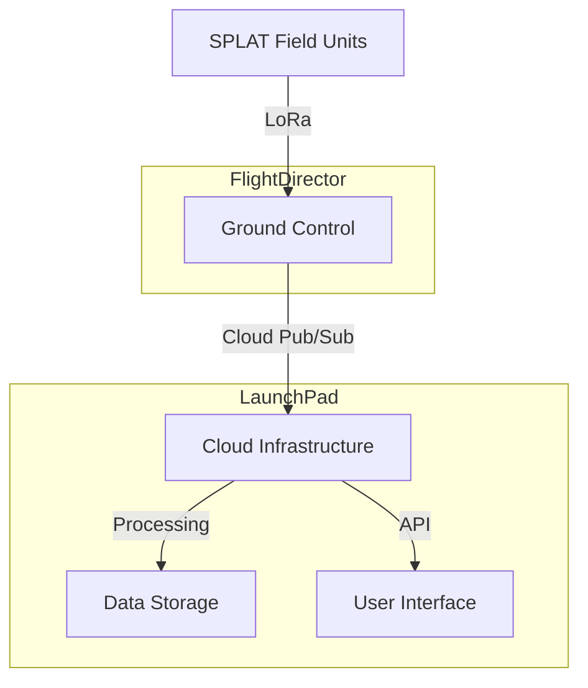

# SPLAT Ground Systems 🛰️

SPLAT (Soil Permeability & Logging Analysis Transponder) Ground Systems provides the infrastructure and configuration management for SPLAT's ground segment operations.

## Overview

This repository contains two main components:

### 🚀 LaunchPad
Infrastructure as Code (Terraform) deployment for SPLAT's cloud infrastructure. LaunchPad manages all cloud resources required for SPLAT operations, including IoT Core, message queues, data storage, and processing functions.

### 🎮 FlightDirector
Ansible configuration management for SPLAT Ground Control stations. FlightDirector handles the deployment and management of local ground station software, including LoRa communication, data processing, and monitoring systems.

## System Architecture



## Prerequisites

### Software Requirements
- Terraform >= 1.0.0
- Ansible >= 2.9
- Python >= 3.9
- Google Cloud SDK
- Git

### Hardware Requirements
- Raspberry Pi 4 (4GB+ RAM)
- LoRa concentrator
- Storage (32GB+ recommended)
- Stable network connection

## Quick Start

### LaunchPad Deployment

```bash
# Clone repository
git clone https://github.com/your-org/splat-ground-systems.git
cd splat-ground-systems/launchpad

# Initialize Terraform
terraform init

# Create development workspace
terraform workspace new dev

# Deploy infrastructure
terraform plan -var-file=environments/dev.tfvars
terraform apply -var-file=environments/dev.tfvars
```

### FlightDirector Setup

```bash
# Navigate to FlightDirector
cd ../flight-director

# Create vault password file
echo "your-secure-password" > .vault_pass

# Update inventory
cp inventory/ground_control.example.yml inventory/ground_control.yml
# Edit with your Ground Control IP

# Deploy Ground Control software
ansible-playbook playbooks/site.yml
```

## Component Details

### LaunchPad Components

- **Mission Control**: IoT Core and Pub/Sub configuration
- **Ground Station**: Cloud Functions and data processing
- **Telemetry**: Storage and database configuration
- **Security**: IAM and authentication setup

```hcl
module "mission_control" {
  source = "./modules/mission_control"
  # ... configuration ...
}
```

### FlightDirector Components

- **System Configuration**: Basic system setup and hardening
- **Docker Environment**: Container runtime and orchestration
- **GSE Software**: Ground station software deployment
- **LoRa Interface**: Radio communication setup
- **Monitoring**: System and application monitoring

```yaml
- name: Deploy Ground Control
  hosts: ground_control
  roles:
    - common
    - docker
    - gse
    - lora
    - monitoring
```

## Development

### Local Development Environment

```bash
# Set up development environment
python -m venv venv
source venv/bin/activate
pip install -r requirements.txt

# Start local services
docker-compose -f docker-compose.dev.yml up
```

### Testing

```bash
# LaunchPad
cd launchpad
terraform fmt -check
terraform validate

# FlightDirector
cd flight-director
ansible-playbook --syntax-check playbooks/site.yml
```

## Deployment

### Environment Configuration

- `dev`: Development environment
- `staging`: Testing environment
- `prod`: Production environment

```bash
# Select environment
terraform workspace select dev|staging|prod

# Deploy with appropriate variables
terraform apply -var-file=environments/$(terraform workspace show).tfvars
```

## Monitoring

### Available Dashboards

- System Health: `http://ground-control:3000/d/system`
- LoRa Metrics: `http://ground-control:3000/d/lora`
- Data Flow: `http://ground-control:3000/d/flow`

### Key Metrics

- Packet Success Rate
- Signal Strength
- System Resource Usage
- Data Processing Latency

## Maintenance

### Regular Tasks

```bash
# Update GSE software
ansible-playbook playbooks/update.yml --tags gse

# System updates
ansible-playbook playbooks/maintenance.yml

# Backup configuration
ansible-playbook playbooks/backup.yml
```

## Contributing

1. Fork the repository
2. Create your feature branch (`git checkout -b feature/AmazingFeature`)
3. Commit your changes (`git commit -m 'Add some AmazingFeature'`)
4. Push to the branch (`git push origin feature/AmazingFeature`)
5. Open a Pull Request

## Security

For security issues, please email security@your-org.com.

## License

This project is licensed under the MIT License - see the [LICENSE.md](LICENSE.md) file for details.

## Acknowledgments

- The SPLAT Development Team
- Contributors and Testers
- Open Source Community

## Project Status

Current Version: 0.1.0-alpha

- [x] Basic Infrastructure
- [x] Ground Control Setup
- [ ] Production Hardening
- [ ] Multi-Region Support
- [ ] Enterprise Features

---
Developed with 🚀 by the SPLAT Team

# Initial Development Requirements - Flight 1

## Ground Control v0.1

### Hardware Requirements
```yaml
Core Components:
  Computer:
    - Raspberry Pi 4B (4GB minimum)
    - 32GB High-endurance SD card
    - Proper power supply (3A)
    - Heat management

  LoRa:
    - RAK2287 concentrator
    - External antenna
    - Proper mounting
    - SPI interface

  Monitoring:
    - Status LEDs
    - Small display (optional)
    - Basic sensors
    - Power monitoring
```

### Software Architecture
```yaml
Core Services:
  LoRa Handler:
    - Packet reception
    - Basic validation
    - Quick response
    - Signal monitoring

  Data Manager:
    - Local buffering
    - Basic processing
    - Storage management
    - Cloud sync

  Status Monitor:
    - System health
    - Node tracking
    - Error logging
    - Basic display

Components:
  /ground_control/
    ├── core/
    │   ├── lora_handler.py
    │   ├── data_manager.py
    │   └── status_monitor.py
    ├── utils/
    │   ├── packet_validator.py
    │   ├── storage.py
    │   └── cloud_sync.py
    └── config/
        ├── system.yaml
        └── nodes.yaml
```

### Minimal Feature Set
```yaml
Essential Functions:
  Node Management:
    - Basic registration
    - Health tracking
    - Status updates
    - Simple alerts

  Data Handling:
    - Packet validation
    - Local storage
    - Basic processing
    - Cloud forwarding

  System Health:
    - Status monitoring
    - Error detection
    - Basic recovery
    - LED indicators
```

## Flight Director v0.1

### Core Components
```yaml
Infrastructure Management:
  - Node registration
  - Configuration control
  - Basic monitoring
  - Alert handling

Deployment:
  Location: GCP
  Services:
    - Cloud Functions
    - Pub/Sub
    - Cloud Storage
    - Firestore

Components:
  /flight_director/
    ├── deployment/
    │   ├── terraform/
    │   └── ansible/
    ├── functions/
    │   ├── node_manager/
    │   ├── data_processor/
    │   └── alert_handler/
    └── config/
        ├── nodes/
        └── system/
```

### Essential Features
```yaml
Base Functionality:
  Node Management:
    - Registration
    - Configuration
    - Status tracking
    - Health monitoring

  Data Processing:
    - Telemetry storage
    - Basic analysis
    - Alert generation
    - Status updates

  Deployment:
    - GC configuration
    - Basic automation
    - Status monitoring
    - Error handling
```

## Flight 1 Test Requirements

### Test Node (SPLAT Hopper)
```yaml
Hardware Setup:
  - ESP32 development board
  - LoRa transceiver
  - Power monitoring
  - Basic sensors

Software Requirements:
  - Power monitoring
  - Basic telemetry
  - Status reporting
  - Error detection

Test Parameters:
  Duration: 72 hours
  Metrics:
    - Power consumption
    - Signal quality
    - Data reliability
    - System stability
```

### Test Protocol
```yaml
Test Sequence:
  1. Initial Setup:
     - GC deployment
     - Node registration
     - System verification
     - Baseline readings

  2. Normal Operation:
     - Regular telemetry
     - Status monitoring
     - Data validation
     - Performance tracking

  3. Solar Test:
     - Charging monitoring
     - Power management
     - Efficiency tracking
     - Status updates

  4. Battery Test:
     - Discharge monitoring
     - Power estimation
     - Critical alerts
     - Shutdown sequence
```

### Success Criteria
```yaml
Minimum Requirements:
  Ground Control:
    - Stable operation
    - Data collection
    - Local storage
    - Basic monitoring

  Flight Director:
    - Node management
    - Data processing
    - Alert handling
    - Basic automation

  SPLAT Node:
    - Power monitoring
    - Data transmission
    - Status reporting
    - Basic operation
```

## Development Priorities

### Phase 1: Core Setup
```yaml
Ground Control:
  1. Basic LoRa setup
  2. Data storage
  3. Status monitoring
  4. Cloud connection

Flight Director:
  1. Node registration
  2. Data processing
  3. Basic automation
  4. Alert handling
```

### Phase 2: Integration
```yaml
System Tests:
  1. Communication
  2. Data flow
  3. Power monitoring
  4. Alert system

Validation:
  1. System stability
  2. Data integrity
  3. Performance metrics
  4. Error handling
```

## Documentation Requirements

### Technical Documentation
```yaml
Core Documents:
  - System architecture
  - Setup procedures
  - Test protocols
  - Operation guide

Development:
  - API documentation
  - Code comments
  - Test procedures
  - Debug guides
```

### Test Documentation
```yaml
Required Records:
  - Test configurations
  - Performance data
  - Error logs
  - Results analysis

Reporting:
  - System performance
  - Data quality
  - Issues found
  - Recommendations
```

# Flight Director Requirements Specification

## Core Functions

### 1. Deployment Management
```yaml
Infrastructure Deployment:
  LaunchPad:
    - API key validation
    - Resource creation
    - Configuration management
    - State monitoring
    - Version control

  Ground Control:
    - Device registration
    - Configuration generation
    - Software deployment
    - Update management
    - Health monitoring

Automation:
  - One-command deployment
  - Configuration templates
  - Validation checks
  - Rollback capability
  - State preservation
```

### 2. Device Management
```yaml
Ground Control Management:
  Registration:
    - Secure device onboarding
    - Configuration assignment
    - Certificate generation
    - Network setup
    - Initial validation

  Monitoring:
    - Health status
    - Performance metrics
    - Resource usage
    - Network status
    - Alert conditions

  Updates:
    - Version management
    - Staged rollouts
    - Dependency tracking
    - Rollback support
    - Update verification
```

### 3. Data Management
```yaml
Telemetry Processing:
  Collection:
    - Data ingestion
    - Validation
    - Storage routing
    - Processing rules
    - Archival policies

  Analysis:
    - Real-time processing
    - Trend analysis
    - Alert generation
    - Report creation
    - Data visualization

  Storage:
    - Time-series data
    - Configuration history
    - Alert records
    - Audit logs
    - Backup management
```

## User Interface

### 1. Mission Control Dashboard
```yaml
Main Features:
  Overview:
    - System status
    - Device map
    - Alert panel
    - Key metrics
    - Quick actions

  Device Management:
    - Device list
    - Status details
    - Configuration editor
    - Update manager
    - Diagnostic tools

  Data Visualization:
    - Real-time charts
    - Historical trends
    - Map overlays
    - Alert history
    - Custom reports
```

### 2. Administrative Interface
```yaml
Management Functions:
  User Management:
    - Role assignment
    - Access control
    - Audit logging
    - Session management
    - Security policies

  System Configuration:
    - Global settings
    - Template management
    - Network configuration
    - Alert rules
    - Backup settings

  Resource Management:
    - Infrastructure overview
    - Cost tracking
    - Resource allocation
    - Performance optimization
    - Capacity planning
```

## Deployment Process

### 1. Initial Setup
```yaml
Steps:
  1. Key Generation:
     - Generate API keys
     - Create service accounts
     - Configure permissions
     - Set up encryption
     - Initialize secrets

  2. Infrastructure Setup:
     - Deploy LaunchPad
     - Configure networking
     - Set up monitoring
     - Initialize storage
     - Enable services

  3. Ground Control Setup:
     - Generate configurations
     - Deploy software
     - Validate connections
     - Configure monitoring
     - Enable reporting
```

### 2. Ongoing Management
```yaml
Management Tasks:
  Monitoring:
    - Health checks
    - Performance tracking
    - Resource usage
    - Alert handling
    - Trend analysis

  Maintenance:
    - Updates deployment
    - Configuration changes
    - Backup verification
    - Security patches
    - Performance tuning
```

## Security Requirements

### 1. Access Control
```yaml
Security Layers:
  Authentication:
    - Multi-factor auth
    - Role-based access
    - Session management
    - Token handling
    - Audit logging

  Authorization:
    - Resource permissions
    - Action limitations
    - Environment separation
    - Data access control
    - API security
```

### 2. Data Protection
```yaml
Protection Measures:
  Encryption:
    - Data at rest
    - Data in transit
    - Key management
    - Secret handling
    - Certificate management

  Compliance:
    - Data retention
    - Access logging
    - Privacy controls
    - Security scanning
    - Policy enforcement
```

## Integration Requirements

### 1. API Support
```yaml
API Features:
  External Access:
    - RESTful API
    - GraphQL support
    - Webhook integration
    - Event streaming
    - Batch operations

  Authentication:
    - API keys
    - OAuth support
    - Token management
    - Rate limiting
    - Usage tracking
```

### 2. Third-Party Integration
```yaml
Integration Points:
  Weather Services:
    - Forecast data
    - Alert integration
    - Historical data
    - Location mapping
    - Update frequency

  Monitoring Services:
    - Metric export
    - Alert forwarding
    - Log aggregation
    - Status updates
    - Performance data
```

## Development Requirements

### 1. Code Organization
```yaml
Structure:
  Modular Design:
    - Clear separation
    - Standard interfaces
    - Version control
    - Documentation
    - Testing framework

  Deployment:
    - Automated builds
    - Container support
    - Environment management
    - Configuration control
    - Release process
```

### 2. Quality Assurance
```yaml
Testing:
  Automation:
    - Unit tests
    - Integration tests
    - End-to-end tests
    - Performance tests
    - Security scans

  Validation:
    - Code quality
    - Security checks
    - Performance metrics
    - Compliance rules
    - Documentation coverage
```

## Success Criteria

### 1. Functional Requirements
```yaml
Core Functions:
  - One-command deployment
  - Automated configuration
  - Real-time monitoring
  - Secure communication
  - Data management
```

### 2. Performance Requirements
```yaml
Metrics:
  - Deployment time < 10 minutes
  - Update time < 5 minutes
  - Response time < 1 second
  - Data latency < 5 seconds
  - 99.9% uptime
```


# SPLAT FlightDirector - Ansible Configuration

## Directory Structure
```
flight-director/
├── ansible.cfg
├── inventory/
│   ├── ground_control.yml
│   └── group_vars/
│       └── ground_control.yml
├── roles/
│   ├── common/
│   ├── docker/
│   ├── gse/
│   ├── lora/
│   ├── monitoring/
│   └── security/
├── playbooks/
│   ├── site.yml
│   ├── update.yml
│   └── maintenance.yml
└── templates/
    ├── docker-compose.yml.j2
    ├── gse-config.yml.j2
    └── nginx.conf.j2
```

## Core Configuration Files

### ansible.cfg
```ini
[defaults]
inventory = inventory/ground_control.yml
remote_user = pi
host_key_checking = False
roles_path = roles
log_path = logs/ansible.log

[privilege_escalation]
become = True
become_method = sudo
```

### inventory/ground_control.yml
```yaml
all:
  children:
    ground_control:
      hosts:
        gse_pi:
          ansible_host: 192.168.1.100
          ansible_user: pi
```

### inventory/group_vars/ground_control.yml
```yaml
---
# Ground Control Configuration
gse_version: "1.0.0"
gse_environment: "development"

# System Configuration
timezone: "UTC"
locale: "en_US.UTF-8"
hostname: "splat-ground-control"

# Docker Configuration
docker_compose_version: "2.17.2"
docker_users:
  - pi

# Network Configuration
wifi_country: "US"
wifi_ssid: "{{ vault_wifi_ssid }}"
wifi_password: "{{ vault_wifi_password }}"

# GCP Configuration
gcp_project_id: "{{ vault_gcp_project_id }}"
gcp_region: "us-central1"

# LoRa Configuration
lora_frequency: 915.0
lora_bandwidth: 125000
lora_spreading_factor: 7
lora_tx_power: 20

# Monitoring Configuration
enable_monitoring: true
prometheus_retention_days: 15
grafana_admin_password: "{{ vault_grafana_password }}"
```

## Playbooks

### playbooks/site.yml
```yaml
---
- name: Configure Ground Control Station
  hosts: ground_control
  become: yes
  
  pre_tasks:
    - name: Update apt cache
      apt:
        update_cache: yes
        cache_valid_time: 3600

  roles:
    - common
    - docker
    - lora
    - gse
    - monitoring
    - security

  post_tasks:
    - name: Verify GSE services
      uri:
        url: "http://localhost:3000/health"
        return_content: yes
      register: health_check
      until: health_check.status == 200
      retries: 6
      delay: 10
```

## Roles

### roles/common/tasks/main.yml
```yaml
---
- name: Set timezone
  timezone:
    name: "{{ timezone }}"

- name: Install required packages
  apt:
    name:
      - git
      - python3-pip
      - python3-venv
      - build-essential
      - nginx
      - ufw
    state: present

- name: Configure hostname
  hostname:
    name: "{{ hostname }}"

- name: Update hosts file
  template:
    src: hosts.j2
    dest: /etc/hosts
    mode: '0644'
```

### roles/docker/tasks/main.yml
```yaml
---
- name: Install Docker dependencies
  apt:
    name:
      - apt-transport-https
      - ca-certificates
      - curl
      - gnupg
      - lsb-release
    state: present

- name: Add Docker GPG key
  apt_key:
    url: https://download.docker.com/linux/debian/gpg
    state: present

- name: Add Docker repository
  apt_repository:
    repo: deb [arch=arm64] https://download.docker.com/linux/debian bullseye stable
    state: present

- name: Install Docker
  apt:
    name:
      - docker-ce
      - docker-ce-cli
      - containerd.io
    state: present

- name: Install Docker Compose
  get_url:
    url: "https://github.com/docker/compose/releases/download/v{{ docker_compose_version }}/docker-compose-linux-aarch64"
    dest: /usr/local/bin/docker-compose
    mode: '0755'
```

### roles/gse/tasks/main.yml
```yaml
---
- name: Create GSE directories
  file:
    path: "{{ item }}"
    state: directory
    mode: '0755'
  with_items:
    - /opt/splat/gse
    - /opt/splat/data
    - /opt/splat/config
    - /opt/splat/logs

- name: Copy GSE configuration
  template:
    src: gse-config.yml.j2
    dest: /opt/splat/config/gse-config.yml
    mode: '0644'

- name: Deploy Docker Compose configuration
  template:
    src: docker-compose.yml.j2
    dest: /opt/splat/docker-compose.yml
    mode: '0644'

- name: Pull Docker images
  docker_compose:
    project_src: /opt/splat
    pull: yes

- name: Start GSE services
  docker_compose:
    project_src: /opt/splat
    state: present
```

### roles/lora/tasks/main.yml
```yaml
---
- name: Install LoRa dependencies
  apt:
    name:
      - python3-pip
      - python3-rpi.gpio
      - wiringpi
    state: present

- name: Configure SPI interface
  lineinfile:
    path: /boot/config.txt
    line: "dtoverlay=spi0-hw-cs"
    state: present

- name: Install Python LoRa library
  pip:
    name: adafruit-circuitpython-rfm9x
    state: present

- name: Copy LoRa configuration
  template:
    src: lora-config.yml.j2
    dest: /opt/splat/config/lora-config.yml
    mode: '0644'
```

## Templates

### templates/docker-compose.yml.j2
```yaml
version: '3.8'

services:
  influxdb:
    image: influxdb:2.0
    volumes:
      - /opt/splat/data/influxdb:/var/lib/influxdb2
    ports:
      - "8086:8086"
    environment:
      - DOCKER_INFLUXDB_INIT_MODE=setup
      - DOCKER_INFLUXDB_INIT_USERNAME=admin
      - DOCKER_INFLUXDB_INIT_PASSWORD={{ vault_influxdb_password }}
      - DOCKER_INFLUXDB_INIT_ORG=splat
      - DOCKER_INFLUXDB_INIT_BUCKET=telemetry

  grafana:
    image: grafana/grafana
    volumes:
      - /opt/splat/data/grafana:/var/lib/grafana
    ports:
      - "3000:3000"
    environment:
      - GF_SECURITY_ADMIN_PASSWORD={{ grafana_admin_password }}

  gse:
    build: 
      context: /opt/splat/gse
    volumes:
      - /opt/splat/config:/config
      - /opt/splat/data:/data
    ports:
      - "8000:8000"
    environment:
      - GSE_ENV={{ gse_environment }}
      - GCP_PROJECT_ID={{ gcp_project_id }}
    devices:
      - "/dev/spidev0.0:/dev/spidev0.0"
```

### templates/gse-config.yml.j2
```yaml
# GSE Configuration
version: {{ gse_version }}
environment: {{ gse_environment }}

# LoRa Configuration
lora:
  frequency: {{ lora_frequency }}
  bandwidth: {{ lora_bandwidth }}
  spreading_factor: {{ lora_spreading_factor }}
  tx_power: {{ lora_tx_power }}

# Cloud Configuration
gcp:
  project_id: {{ gcp_project_id }}
  region: {{ gcp_region }}

# Data Storage
storage:
  path: /data
  retention_days: 30

# Monitoring
monitoring:
  enabled: {{ enable_monitoring }}
  metrics_port: 9090
```

## Usage Instructions

```bash
# Check syntax
ansible-playbook playbooks/site.yml --syntax-check

# Run playbook with vault
ansible-playbook playbooks/site.yml --ask-vault-pass

# Update GSE components
ansible-playbook playbooks/update.yml --tags gse

# Run maintenance tasks
ansible-playbook playbooks/maintenance.yml
```

## Notes:
1. Security Considerations:
   - Vault for sensitive data
   - UFW firewall configuration
   - Secure defaults
   - Regular updates

2. Development Features:
   - Easy configuration
   - Development environment
   - Monitoring included
   - Quick updates

3. Maintenance:
   - Backup configuration
   - Update procedures
   - Health checks
   - Logging setup


# Ground Control Modular Architecture

## Repository Structure
```
ground_control/
├── .github/
│   └── workflows/
│       ├── test.yml
│       ├── build.yml
│       └── deploy.yml
│
├── modules/
│   ├── core/              # Core system management
│   │   ├── __init__.py
│   │   ├── system.py     # System management
│   │   ├── config.py     # Configuration handling
│   │   └── events.py     # Event system
│   │
│   ├── lora/             # LoRa communication
│   │   ├── __init__.py
│   │   ├── handler.py    # Packet handling
│   │   ├── decoder.py    # Message decoding
│   │   └── manager.py    # LoRa device management
│   │
│   ├── storage/          # Local data management
│   │   ├── __init__.py
│   │   ├── buffer.py     # Memory buffer
│   │   ├── persistent.py # Disk storage
│   │   └── cleanup.py    # Storage management
│   │
│   ├── display/          # Local display handling
│   │   ├── __init__.py
│   │   ├── lcd.py       # LCD interface
│   │   ├── led.py       # LED control
│   │   └── pages.py     # Display pages
│   │
│   ├── cloud/            # Cloud communication
│   │   ├── __init__.py
│   │   ├── sync.py      # Data synchronization
│   │   ├── pubsub.py    # Message handling
│   │   └── status.py    # Cloud status reporting
│   │
│   └── monitor/          # System monitoring
│       ├── __init__.py
│       ├── health.py     # Health checking
│       ├── metrics.py    # Metrics collection
│       └── alerts.py     # Alert generation
│
├── config/
│   ├── default.yml       # Default configuration
│   ├── modules.yml       # Module configuration
│   └── secrets.yml.enc   # Encrypted secrets
│
├── scripts/
│   ├── install.sh        # Installation script
│   ├── update.sh         # Update script
│   └── backup.sh         # Backup script
│
└── docker/               # Containerization
    ├── Dockerfile
    └── docker-compose.yml
```

## Module Communication
```python
# Core event system for inter-module communication
from dataclasses import dataclass
from typing import Any, Dict

@dataclass
class Event:
    type: str
    source: str
    data: Dict[str, Any]
    timestamp: float

class EventBus:
    def __init__(self):
        self.subscribers = {}
        
    def subscribe(self, event_type: str, callback):
        if event_type not in self.subscribers:
            self.subscribers[event_type] = []
        self.subscribers[event_type].append(callback)
        
    def publish(self, event: Event):
        if event.type in self.subscribers:
            for callback in self.subscribers[event.type]:
                callback(event)
```

## Module Template
```python
# Base class for all modules
class BaseModule:
    def __init__(self, event_bus, config):
        self.event_bus = event_bus
        self.config = config
        self.running = False
        
    async def start(self):
        self.running = True
        await self.setup()
        
    async def stop(self):
        self.running = False
        await self.cleanup()
        
    async def setup(self):
        raise NotImplementedError
        
    async def cleanup(self):
        raise NotImplementedError
```

## Deployment Configuration
```yaml
# docker-compose.yml
version: '3.8'

services:
  ground_control:
    build: .
    restart: always
    volumes:
      - ./config:/app/config
      - ./data:/app/data
    devices:
      - "/dev/spidev0.0:/dev/spidev0.0"
    environment:
      - GC_ENV=production
      - GC_CONFIG=/app/config/default.yml
    
  display:
    build: ./modules/display
    privileged: true
    depends_on:
      - ground_control
```

## Automated Build
```yaml
# .github/workflows/build.yml
name: Build and Test

on:
  push:
    branches: [ main, develop ]
  pull_request:
    branches: [ main ]

jobs:
  build:
    runs-on: ubuntu-latest
    
    steps:
    - uses: actions/checkout@v2
    
    - name: Set up Python
      uses: actions/setup-python@v2
      with:
        python-version: '3.9'
    
    - name: Install dependencies
      run: |
        python -m pip install --upgrade pip
        pip install -r requirements.txt
        
    - name: Run tests
      run: |
        pytest tests/
        
    - name: Build Docker image
      run: |
        docker build -t ground-control .
```

## Module Configuration
```yaml
# config/modules.yml
lora:
  enabled: true
  device: /dev/spidev0.0
  frequency: 915
  bandwidth: 125000
  coding_rate: 5
  spreading_factor: 7

storage:
  enabled: true
  buffer_size: 100MB
  max_storage: 1GB
  cleanup_interval: 1h

display:
  enabled: true
  type: ssd1306
  width: 128
  height: 64
  refresh_rate: 1

monitor:
  enabled: true
  check_interval: 30s
  metrics_interval: 1m
  alert_threshold: 90
```

## Local Display Interface
```python
# modules/display/pages.py
class DisplayManager:
    def __init__(self, display, event_bus):
        self.display = display
        self.event_bus = event_bus
        self.pages = {}
        self.current_page = None
        
    def add_page(self, name, page):
        self.pages[name] = page
        
    async def show_page(self, name):
        if name in self.pages:
            self.current_page = self.pages[name]
            await self.update()
            
    async def update(self):
        if self.current_page:
            await self.current_page.render(self.display)
```

## Cloud Integration
```python
# modules/cloud/sync.py
class CloudSync:
    def __init__(self, config, event_bus):
        self.config = config
        self.event_bus = event_bus
        self.queue = asyncio.Queue()
        
    async def start(self):
        while True:
            try:
                data = await self.queue.get()
                await self.send_to_cloud(data)
            except Exception as e:
                await self.handle_error(e)
                
    async def send_to_cloud(self, data):
        # Send data to Flight Director
        # Implement retry logic
        pass
```

## Health Monitoring
```python
# modules/monitor/health.py
class HealthMonitor:
    def __init__(self, config, event_bus):
        self.config = config
        self.event_bus = event_bus
        self.metrics = {}
        
    async def check_health(self):
        cpu = await self.get_cpu_usage()
        memory = await self.get_memory_usage()
        disk = await self.get_disk_usage()
        
        self.event_bus.publish(Event(
            type="health_update",
            source="monitor",
            data={
                "cpu": cpu,
                "memory": memory,
                "disk": disk
            }
        ))
```


# SPLAT LaunchPad - Repository Structure

## Repository Layout
```
splat-launchpad/
├── .github/
│   ├── workflows/
│   │   ├── terraform-plan.yml
│   │   └── terraform-apply.yml
│   └── CODEOWNERS
├── environments/
│   ├── dev/
│   │   ├── backend.tf
│   │   ├── main.tf
│   │   ├── variables.tf
│   │   └── terraform.tfvars.example
│   ├── staging/
│   │   └── ...
│   └── prod/
│       └── ...
├── modules/
│   ├── mission_control/
│   │   ├── main.tf
│   │   ├── variables.tf
│   │   ├── outputs.tf
│   │   └── README.md
│   ├── ground_station/
│   │   └── ...
│   ├── telemetry/
│   │   └── ...
│   └── security/
│       └── ...
├── scripts/
│   ├── tf-init.sh
│   └── tf-cleanup.sh
├── .gitignore
├── .terraform-version
├── LICENSE
└── README.md
```

## Key Configuration Files

### .gitignore
```gitignore
# Local .terraform directories
**/.terraform/*

# .tfstate files
*.tfstate
*.tfstate.*

# Crash log files
crash.log
crash.*.log

# Exclude sensitive variables files
*.tfvars
!*.tfvars.example

# Ignore override files
override.tf
override.tf.json
*_override.tf
*_override.tf.json

# Ignore CLI configuration files
.terraformrc
terraform.rc

# Exclude sensitive key files
*.pem
*.key
credentials.json

# OS specific
.DS_Store
.vscode/
```

### .github/workflows/terraform-plan.yml
```yaml
name: 'Terraform Plan'

on:
  pull_request:
    branches:
      - main
      - develop

jobs:
  terraform:
    name: 'Terraform Plan'
    runs-on: ubuntu-latest

    steps:
    - name: Checkout
      uses: actions/checkout@v2

    - name: Setup Terraform
      uses: hashicorp/setup-terraform@v1
      with:
        terraform_version: 1.0.0

    - name: Configure GCP Credentials
      uses: google-github-actions/auth@v0
      with:
        credentials_json: ${{ secrets.GCP_SA_KEY }}

    - name: Terraform Init
      run: |
        cd environments/dev
        terraform init

    - name: Terraform Format
      run: terraform fmt -check -recursive

    - name: Terraform Plan
      run: |
        cd environments/dev
        terraform plan -no-color
      env:
        TF_VAR_project_id: ${{ secrets.GCP_PROJECT_ID }}
```

### environments/dev/main.tf
```hcl
terraform {
  required_version = ">= 1.0.0"

  required_providers {
    google = {
      source  = "hashicorp/google"
      version = "~> 4.0"
    }
  }

  backend "gcs" {
    bucket = "splat-terraform-state-dev"
    prefix = "terraform/state"
  }
}

provider "google" {
  project = var.project_id
  region  = var.region
}

module "mission_control" {
  source = "../../modules/mission_control"

  project_id      = var.project_id
  environment     = var.environment
  iot_registry_id = var.iot_registry_id
}

# Additional modules...
```

### environments/dev/terraform.tfvars.example
```hcl
project_id      = "splat-dev-xxxxx"
region          = "us-central1"
environment     = "dev"
iot_registry_id = "splat-devices"
```

## Module Structure Example

### modules/mission_control/main.tf
```hcl
resource "google_cloudiot_registry" "splat_registry" {
  name     = "${var.iot_registry_id}-${var.environment}"
  region   = var.region
  project  = var.project_id

  event_notification_configs {
    pubsub_topic_name = google_pubsub_topic.telemetry.id
  }

  state_notification_config = {
    pubsub_topic_name = google_pubsub_topic.device_state.id
  }
}

# Additional resources...
```

### modules/mission_control/variables.tf
```hcl
variable "project_id" {
  description = "The GCP project ID"
  type        = string
}

variable "environment" {
  description = "The environment (dev, staging, prod)"
  type        = string
}

variable "iot_registry_id" {
  description = "The IoT Core registry ID"
  type        = string
}
```

## Setup Instructions

1. Initial Repository Setup
```bash
# Clone the repository
git clone https://github.com/your-org/splat-launchpad.git
cd splat-launchpad

# Create development branch
git checkout -b develop

# Create environment-specific configuration
cp environments/dev/terraform.tfvars.example environments/dev/terraform.tfvars
```

2. GitHub Repository Settings
- Enable branch protection on `main`
- Require pull request reviews
- Enable status checks
- Configure CODEOWNERS

3. GitHub Secrets Configuration
```yaml
Required Secrets:
  GCP_SA_KEY: Service account JSON key
  GCP_PROJECT_ID: Project ID for each environment
  TF_API_TOKEN: Terraform Cloud API token (if using)
```

## Development Workflow

1. Feature Development
```bash
# Create feature branch
git checkout -b feature/new-feature

# Make changes and test locally
terraform init
terraform plan

# Commit changes
git add .
git commit -m "feat: add new feature"

# Push and create PR
git push origin feature/new-feature
```

2. Pull Request Process
- Create PR to `develop`
- Wait for CI checks
- Get review approval
- Merge to `develop`

3. Release Process
- Create PR from `develop` to `main`
- Verify staging deployment
- Get final approval
- Merge to `main`

## Best Practices

### Code Organization
```yaml
Modules:
  - One responsibility per module
  - Clear input/output definitions
  - README for each module
  - Example configurations

Variables:
  - Use descriptive names
  - Include descriptions
  - Define types and validation
  - Provide examples

State Management:
  - Use remote state
  - Enable versioning
  - Implement state locking
  - Regular backups
```

### Security
```yaml
Access Control:
  - Use service accounts
  - Minimum required permissions
  - Rotate credentials
  - Audit logging

Sensitive Data:
  - Never commit .tfvars
  - Use GitHub secrets
  - Encrypt sensitive values
  - Regular security reviews
```
